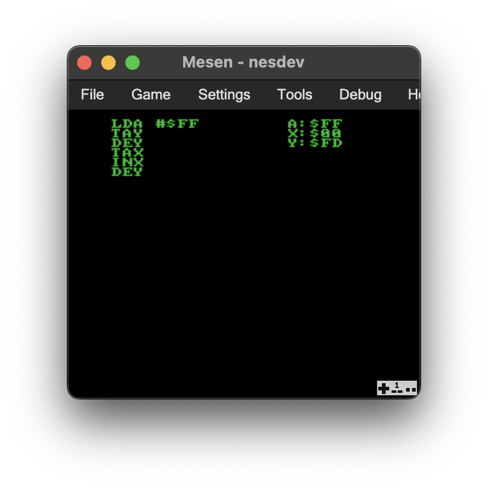

# NES Dev
* Proof of concept 6502 code editor and executor for the NES.

## Building
* Simply run `make`
    * Requires make, ca65, and ld65 to be included in your PATH.
## Controls
* Press A to start a new line of code.
    * Press up/down to scroll through the available instructions.
    * Press A to select an instruction.
    * If that instruction accepts an immediate:
        * Press up/down to scroll through the hexadecimal values.
        * Press A to select a value.
* Press start to execute the code and see the results.
    * Instructions that have not been completed will be ignored.
* As this is a proof of concept, deleting and/or re-running code is currently unsupported!  Please reset the console to start over.  There is also no bounds checking for code on screen nor instructions in RAM.  You've been warned.
## What's going on here?
* As you select instructions, the corresponding op codes are copied into the console's RAM sequentially.
* An `RTS` op code is always appended to the current instructions to support execution.
* When you execute the code, it's simply a `JSR` to that location in RAM.
## File Summary
* `nesdev.s`
    * Complete source code in 6502 assembly.
* `chars.inc`
    * Tile data in text format.
* `system.inc`
    * Canonical names for NES registers.
* `nrom.cfg`
    * Linker configuration for an [NES NROM](https://www.nesdev.org/wiki/NROM) rom file.
* `nesdev.nes`
    * Prebuilt rom file.